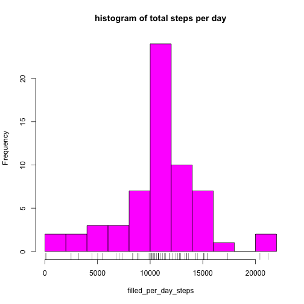

## Introduction

In this report, we analyze the data from an activity monitor on a single 
individual over a period of two months, during October and November 2012. The 
data consists of the number of steps taken during each 5 minute interval of each 
day during this period. In the following, we read the data from a CSV file, and 
each subsequent section answers the specific question indicated by the section 
name.

## Loading and preprocessing the data

As the code below shows, the data consists of three columns: "steps", "date" 
and "interval". 


```r
system("cat activity.csv | head -6", intern = TRUE)
```

```
## [1] "\"steps\",\"date\",\"interval\"" "NA,\"2012-10-01\",0"            
## [3] "NA,\"2012-10-01\",5"             "NA,\"2012-10-01\",10"           
## [5] "NA,\"2012-10-01\",15"            "NA,\"2012-10-01\",20"
```

We read the CSV file into a data frame, and in order to identify patterns on a
per-interval, per-day and weekend-vs-weekday basis, we augment the data frame 
with additional factors as columns. Summary properties of the augmented data 
frame are also shown below. The data consists of 17568 = (12 5-minute intervals 
per hour)\*(24 hours per day)\*(61 days). The date is converted to a factor 
"day_f" counted from the first date, thus ranging from 1 to 61. The 5-minute 
interval identifier, ranging for each day from 0 to 2355 (e.g. "2355" stands for 
23 hours and 55 minutes), is converted to a factor "interval_f". 


```r
library(dplyr)
```

```
## 
## Attaching package: 'dplyr'
## 
## The following object is masked from 'package:stats':
## 
##     filter
## 
## The following objects are masked from 'package:base':
## 
##     intersect, setdiff, setequal, union
```

```r
unzip("activity.zip")
activity_df <- read.csv( file = "activity.csv", 
                         colClasses = c("numeric", "Date", "integer"),
                         nrows = 17568 )

activity_df <- 
 activity_df %>% 
 mutate( interval_f = factor(interval), 
         day_f = factor(date - date[1] + 1) )

str(activity_df)
```

```
## 'data.frame':	17568 obs. of  5 variables:
##  $ steps     : num  NA NA NA NA NA NA NA NA NA NA ...
##  $ date      : Date, format: "2012-10-01" "2012-10-01" ...
##  $ interval  : int  0 5 10 15 20 25 30 35 40 45 ...
##  $ interval_f: Factor w/ 288 levels "0","5","10","15",..: 1 2 3 4 5 6 7 8 9 10 ...
##  $ day_f     : Factor w/ 61 levels "1","2","3","4",..: 1 1 1 1 1 1 1 1 1 1 ...
```

```r
summary(activity_df)
```

```
##      steps             date               interval        interval_f   
##  Min.   :  0.00   Min.   :2012-10-01   Min.   :   0.0   0      :   61  
##  1st Qu.:  0.00   1st Qu.:2012-10-16   1st Qu.: 588.8   5      :   61  
##  Median :  0.00   Median :2012-10-31   Median :1177.5   10     :   61  
##  Mean   : 37.38   Mean   :2012-10-31   Mean   :1177.5   15     :   61  
##  3rd Qu.: 12.00   3rd Qu.:2012-11-15   3rd Qu.:1766.2   20     :   61  
##  Max.   :806.00   Max.   :2012-11-30   Max.   :2355.0   25     :   61  
##  NA's   :2304                                           (Other):17202  
##      day_f      
##  1      :  288  
##  2      :  288  
##  3      :  288  
##  4      :  288  
##  5      :  288  
##  6      :  288  
##  (Other):15840
```

## What is mean total number of steps taken per day?

First, we compute the total number of steps per day (ignoring missing values) 
for each of the 61 days, and plot its histogram. 


```r
per_day <- 
 activity_df %>% 
 group_by( day_f ) %>% 
 summarize( steps_per_day = sum(steps, na.rm = TRUE) )

per_day_steps <- per_day$steps_per_day

hist( per_day_steps, col = "blue", breaks = 10, 
      main = "histogram of total steps per day" )
rug( per_day$steps_per_day )
```

 

Then, we determine the mean and median of the total number of steps per day. 


```r
print(  mean( per_day$steps_per_day )  )
```

```
## [1] 9354.23
```

```r
print(  median( per_day$steps_per_day )  )
```

```
## [1] 10395
```

## What is the average daily activity pattern?

First, we compute the average (across all days) of the number of steps per daily
interval (ignoring missing values) and plot it as a time series across the day. 


```r
per_interval <- 
 activity_df %>% 
 group_by( interval_f ) %>% 
 summarize( avg_steps_per_interval = mean(steps, na.rm = TRUE) )

str(per_interval)
```

```
## Classes 'tbl_df', 'tbl' and 'data.frame':	288 obs. of  2 variables:
##  $ interval_f            : Factor w/ 288 levels "0","5","10","15",..: 1 2 3 4 5 6 7 8 9 10 ...
##  $ avg_steps_per_interval: num  1.717 0.3396 0.1321 0.1509 0.0755 ...
##  - attr(*, "drop")= logi TRUE
```

```r
intervals <- as.integer(per_interval$interval_f)
avg_per_interval_steps <- per_interval$avg_steps_per_interval

plot( intervals, avg_per_interval_steps, type = "l", col = "red", 
      xlab = "interval", ylab = "average number of steps",  
      main = "across-all-days average of steps per interval" )
```

 

Then, we determine the interval with the maximum across-61-days average number 
of steps, printing the maximizing index (which is in 1-288) first and then the 
corresponding interval identifier. 


```r
print(  which.max( avg_per_interval_steps )  )
```

```
## [1] 104
```

```r
print(  per_interval$interval_f[ which.max( avg_per_interval_steps ) ]  )
```

```
## [1] 835
## 288 Levels: 0 5 10 15 20 25 30 35 40 45 50 55 100 105 110 115 120 ... 2355
```

The maximizing interval is the 104th, out of the 288 intervals in a day, and 
corresponds to the 5-minute interval with identifier "835", i.e. ending 8:35am.

## Imputing missing values

The indexes of rows in the data with missing values of "steps" are determined 
below, along with the total number of such rows. 


```r
activity_df <- 
 activity_df %>% 
 mutate( is_missing_steps = is.na(steps) )

indexes_missing_steps <- which( activity_df$is_missing_steps )

print( length(indexes_missing_steps) )
```

```
## [1] 2304
```

As confirmation, note that we already found this total number of NAs when we 
applied the summary() function in the "loading and preprocessing" section.

We shall fill in the missing value of a particular interval (of a particular 
day) with the previously-computed across-all-days average for that interval of 
the day, which we had saved in the vector "avg_per_interval_steps", with the 
corresponding interval identifiers found in "per_interval$interval_f".

The summaries of the resulting data frame "filled_activity_df", and a look at 
the top few values, demonstrate that we have cleaned up the missing values. 


```r
filled_activity_df <- 
 activity_df %>% 
 mutate( steps = ifelse( is_missing_steps, 
                         avg_per_interval_steps[ match(interval_f, 
                                                       per_interval$interval_f) ], 
                         steps
                       ) 
       )

summary( filled_activity_df )
```

```
##      steps             date               interval        interval_f   
##  Min.   :  0.00   Min.   :2012-10-01   Min.   :   0.0   0      :   61  
##  1st Qu.:  0.00   1st Qu.:2012-10-16   1st Qu.: 588.8   5      :   61  
##  Median :  0.00   Median :2012-10-31   Median :1177.5   10     :   61  
##  Mean   : 37.38   Mean   :2012-10-31   Mean   :1177.5   15     :   61  
##  3rd Qu.: 27.00   3rd Qu.:2012-11-15   3rd Qu.:1766.2   20     :   61  
##  Max.   :806.00   Max.   :2012-11-30   Max.   :2355.0   25     :   61  
##                                                         (Other):17202  
##      day_f       is_missing_steps
##  1      :  288   Mode :logical   
##  2      :  288   FALSE:15264     
##  3      :  288   TRUE :2304      
##  4      :  288   NA's :0         
##  5      :  288                   
##  6      :  288                   
##  (Other):15840
```

```r
str( filled_activity_df )
```

```
## 'data.frame':	17568 obs. of  6 variables:
##  $ steps           : num  1.717 0.3396 0.1321 0.1509 0.0755 ...
##  $ date            : Date, format: "2012-10-01" "2012-10-01" ...
##  $ interval        : int  0 5 10 15 20 25 30 35 40 45 ...
##  $ interval_f      : Factor w/ 288 levels "0","5","10","15",..: 1 2 3 4 5 6 7 8 9 10 ...
##  $ day_f           : Factor w/ 61 levels "1","2","3","4",..: 1 1 1 1 1 1 1 1 1 1 ...
##  $ is_missing_steps: logi  TRUE TRUE TRUE TRUE TRUE TRUE ...
```

```r
temp_head_df <- head( filled_activity_df[ is.na(activity_df$steps), ] )
temp_head_df
```

```
##       steps       date interval interval_f day_f is_missing_steps
## 1 1.7169811 2012-10-01        0          0     1             TRUE
## 2 0.3396226 2012-10-01        5          5     1             TRUE
## 3 0.1320755 2012-10-01       10         10     1             TRUE
## 4 0.1509434 2012-10-01       15         15     1             TRUE
## 5 0.0754717 2012-10-01       20         20     1             TRUE
## 6 2.0943396 2012-10-01       25         25     1             TRUE
```

```r
avg_per_interval_steps[ match( temp_head_df$interval_f, 
                               per_interval$interval_f ) ]
```

```
## [1] 1.7169811 0.3396226 0.1320755 0.1509434 0.0754717 2.0943396
```

The following is a repeat of the section "what is mean total number of steps 
taken per day", but applied to the missing-values-filled dataset.

First, we compute the total number of steps per day for each of the 61 days, 
and plot its histogram. 


```r
filled_per_day <- 
 filled_activity_df %>% 
 group_by( day_f ) %>% 
 summarize( steps_per_day = sum(steps, na.rm = TRUE) )

filled_per_day_steps <- filled_per_day$steps_per_day

hist( filled_per_day_steps, col = "magenta", breaks = 10, 
      main = "histogram of total steps per day" )
rug( filled_per_day$steps_per_day )
```

 

Then, we determine the mean and median of the total number of steps per day. 


```r
print(  mean( filled_per_day$steps_per_day )  )
```

```
## [1] 10766.19
```

```r
print(  median( filled_per_day$steps_per_day )  )
```

```
## [1] 10766.19
```


Finally, we observe that missing-value imputation concentrates the distribution 
around its mean/median (although it is unclear why the new mean and median are 
*exactly* the same in the results above, rather than merely closer than they were
before).

## Are there differences in activity patterns between weekdays and weekends?

We first augment the filled-in data frame with a factor variable indicating if 
the date was on a weekday vs. on a weekend. 


```r
filled_activity_df <- 
 filled_activity_df %>% 
 mutate( daytype_f = factor( ifelse(weekdays(date) %in% c("Saturday", "Sunday"), 
                                     "weekend", "weekday"), 
                             levels = c("weekday", "weekend") 
                           )
       )

table( filled_activity_df$daytype_f )
```

```
## 
## weekday weekend 
##   12960    4608
```

Finally, we compare the activity patterns on weekdays vs. weekends, by plotting 
the across-all-weekdays-average per-interval number of steps and the across-all-weekends-average per-interval number of steps, in a panel plot with two panels.


```r
per_daytype_per_interval <- 
 filled_activity_df %>% 
 group_by( daytype_f, interval_f ) %>% 
 summarize( avg_per_daytype_steps_per_interval = mean(steps, na.rm = TRUE) )

str(per_daytype_per_interval)
```

```
## Classes 'grouped_df', 'tbl_df', 'tbl' and 'data.frame':	576 obs. of  3 variables:
##  $ daytype_f                         : Factor w/ 2 levels "weekday","weekend": 1 1 1 1 1 1 1 1 1 1 ...
##  $ interval_f                        : Factor w/ 288 levels "0","5","10","15",..: 1 2 3 4 5 6 7 8 9 10 ...
##  $ avg_per_daytype_steps_per_interval: num  2.251 0.445 0.173 0.198 0.099 ...
##  - attr(*, "vars")=List of 1
##   ..$ : symbol daytype_f
##  - attr(*, "drop")= logi TRUE
```

```r
f_day_type <- per_daytype_per_interval$daytype_f
intervals2 <- as.integer(per_daytype_per_interval$interval_f)
avg_per_daytype_per_interval_steps <- 
 per_daytype_per_interval$avg_per_daytype_steps_per_interval

library(lattice)
xyplot( avg_per_daytype_per_interval_steps ~ intervals2 | f_day_type, 
        panel = function(x, y, ...) { 
                        panel.xyplot(x, y, ..., 
                                     type = "l") 
                },
        xlab = "interval", 
        ylab = "Number of steps", 
        layout = c(1, 2), 
        col = "blue", 
        main = "across-all-days average of steps per interval" 
      )
```

 

We see that the 2-month average number of steps has a more distinct peak (around
get-to-work time) for weekdays, when compared to weekends. Further, there is a
reduction in activity over the weekend (peak > 200 average-number-of-steps for
weekdays, versus ~ 150 steps for weekends).


